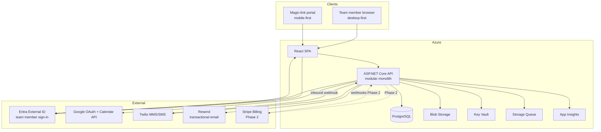
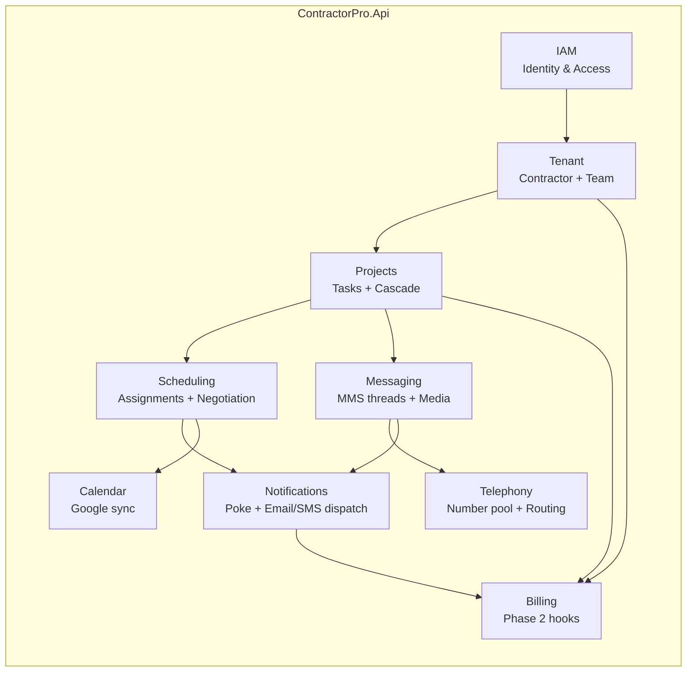
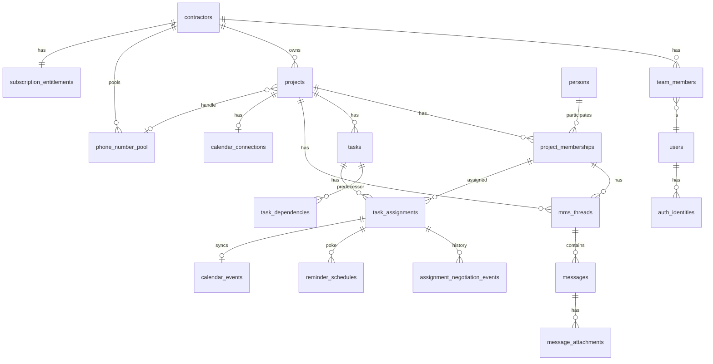
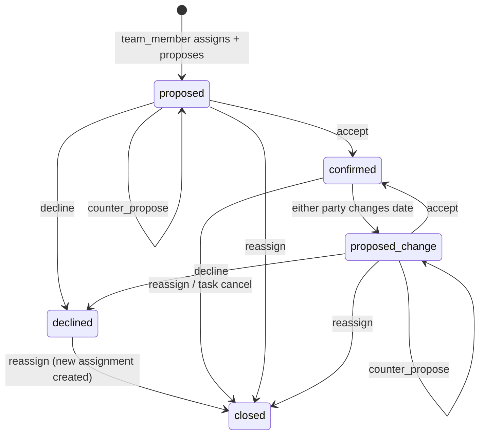
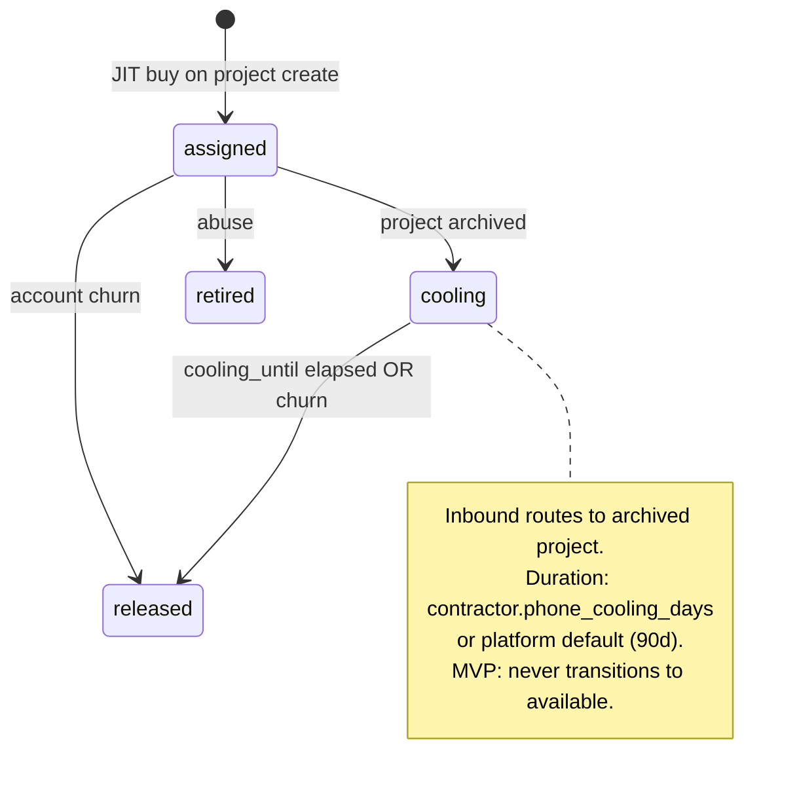

# ContractorPro Architecture v0.1

MVP Phase 1 architecture for a solo-founder build. **Billing enforcement is Phase 2** — schema and service hooks are included now so entitlements do not require a migration later.

---

## 1. Technology stack (recommended)

Decisions below ratify existing exploration docs. Open forks are called out explicitly.

### 1.1 Locked / strong lean

| Layer | Choice | Why |
|-------|--------|-----|
| **Paradigm** | Modular monolith | One deployable API for years; clear module boundaries now, extract later if needed |
| **API** | ASP.NET Core (.NET 9) | Team strength, Azure-native, strong typing for AI-assisted dev |
| **ORM** | EF Core + Npgsql | Migrations, PostgreSQL provider, familiar tooling |
| **Database** | PostgreSQL 16 | Relational fit; Azure Flexible Server in prod; Neon/Docker in dev |
| **Frontend** | **React 19 + TypeScript + Vite + shadcn/ui** | AI-assisted (vibe coding) workflow; largest example corpus; single SPA for GC dashboard + magic-link portal. Decided 2026-08-20 (React over Blazor). |
| **Frontend layout** | **Single SPA** — `/app/*` (team member, desktop-first) + `/p/*` (portal, mobile-first) | One deployable; shared components. Decided 2026-08-20. |
| **Blob storage** | Azure Blob Storage | MMS images, web uploads; metadata in Postgres |
| **Hosting** | Azure App Service (API) + Azure Static Web Apps or same App Service (UI) | Matches skillset and exploration |
| **Secrets** | Azure Key Vault | OAuth client secrets, Twilio keys, Stripe webhook secret (Phase 2) |
| **Observability** | Application Insights | Logs, traces, dependency calls |
| **SMS/MMS** | Twilio (Telnyx spike) | Group MMS required; ACS does not support group MMS |
| **Transactional email** | **Resend** | Magic links, invites, pokes, customer channel confirm; `IEmailSender` abstraction. Decided 2026-08-20. |
| **SMS/MMS compliance (10DLC)** | **Platform brand + campaign** | One ContractorPro 10DLC registration in Twilio Trust Hub; all tenant handle #s linked to platform campaign. Per-GC brands deferred. Decided 2026-08-20. |
| **Google APIs** | Google Cloud project (Calendar + Sign-In) | APIs only — app stays on Azure |
| **Background work** | **`IHostedService`** in-process for MVP (poke, webhook retries, calendar sync); Azure Storage Queue v0.1.1 | Poke cadence, webhook retries, calendar sync |
| **Billing (Phase 2)** | Stripe Billing | Checkout, Customer Portal, webhooks — **not wired in Phase 1** |
| **Team member auth** | **Entra External ID** (CIAM) | Google OAuth first via `Microsoft.Identity.Web`; link-only in `auth_identities` — no password storage. Decided 2026-08-20. |
| **Team member session** | **BFF cookie** | Entra OAuth callback on API → HTTP-only session cookie; React `credentials: 'include'`. Not SPA bearer/JWT in browser. Decided 2026-08-20. |
| **Platform admin auth** | Workforce Entra ID (separate app registration) | Thomas/Alex on `/admin/*` — not CIAM customer identities. Allowlist of `oid` in v0.1. |
| **Invitee auth** | Custom magic links | Signed tokens in API — not Entra. Subs/customers never OAuth in v0.1. |
| **Calendar mode** | **Pro-provided per project** | App creates one Google calendar per project under GC's OAuth; subs/customers via event attendee invites on confirm. Decided 2026-08-20. |
| **Calendar UI (app)** | **Portfolio + per-project views** | Contractor sees all projects on one calendar in-app (default option); filter by project. Google side stays per-project calendars. |
| **Number reuse (same company)** | **No reuse in MVP** | New project always JIT-buys fresh number; archive → cooling (default **90d**) → release to Twilio. Per-contractor override + global default. Decided 2026-08-20; cooling **90d** 2026-08-20. |
| **Dashboard refresh** | **Polling (60s default)** | Team member dashboard polls API; interval from **platform admin** `platform_settings` only — not per-contractor. SignalR deferred. Decided 2026-08-20. |
| **Invitee identity** | **Global `persons` by phone** | One person per `phone_e164`; `project_memberships` for project + role (sub/customer). Cross-contractor supported. **Contractor subscribers may also be subs/customers elsewhere** — separate from `users`/`team_members`. Decided 2026-08-20. |

### 1.2 Resolved forks (locked 2026-08-20)

All pre-M1 forks from planning checklist Sections A–C are locked. See [planning-decision-checklist.md](./planning-decision-checklist.md).

| Fork | MVP decision |
|------|----------------|
| Cascade in MVP | **Yes** — E7 in build order |
| Sub/customer Apple Calendar | **Deferred v0.1.1** — Google attendee invites only |
| GC auth providers | **Google only** M1 |
| Admin UI | **No `/admin` in M1** — API + manual ops |
| Handle # cooling | **90d default**; per-contractor override |
| Handle # reuse | **Always fresh JIT** in MVP |
| Decline behavior | **Hard decline** + reassign |
| Magic link TTL | **7 days** |
| Background jobs | **IHostedService** |
| API client | **Hand-typed fetch** |
| CPaaS | **Twilio** (SP-2 before prod scale) |
| Portfolio calendar | **Yes** — in-app unified view |
| Phase 2 annual pricing | **~2 months free** on annual |

### 1.3 Explicitly not in Phase 1

- Microservices, event bus (Service Bus), Kubernetes
- **Blazor** (WASM or Server) — React chosen for AI-assisted UI velocity
- Native mobile apps, PWA offline
- Auth.js (Node-centric; poor fit for .NET API)
- Azure Communication Services for MMS (no group MMS)
- ACS Email — Resend chosen for transactional email (2026-08-20)
- Stripe Checkout / webhooks (Phase 2)
- AI comms (v0.2+)

### 1.4 Frontend architecture (decided)

| Concern | Choice |
|---------|--------|
| **Bundler** | Vite |
| **UI kit** | shadcn/ui + Tailwind CSS |
| **Routing** | React Router — `/app/*`, `/p/*`, `/admin/*` |
| **API client** | **Hand-typed fetch** against `/api/v1`; OpenAPI codegen v0.1.1 | Decided 2026-08-20 §C |
| **Auth (team member)** | Entra OAuth on API → HTTP-only session cookie (`credentials: 'include'`) |
| **Auth (portal)** | Magic-link token in query or `Authorization` header |
| **Dashboard polling** | Default **60s** interval; refetch on tab focus; reads `platform_settings.dashboard_poll_interval_seconds` (admin-only, not per-contractor) |

**Why not Blazor:** Single-language C# is appealing, but AI-assisted UI generation is materially better in React; GC dashboard + mobile portal both benefit.

### 1.5 Email (decided)

| Concern | Choice |
|---------|--------|
| **Provider** | Resend |
| **From address** | `notify@contractorpro.com` (platform sender; per-GC From deferred) |
| **Abstraction** | `IEmailSender` in Notifications module — swappable if migrating to ACS later |
| **DNS** | SPF/DKIM/DMARC on sending domain (separate from SMS 10DLC) |
| **Use cases** | Magic links, invites, poke (`notify_via` email/both), customer channel confirm, Phase 2 dunning |

---

### 1.6 Calendar architecture (decided)

**Dual-view model** — same schedule data, two lenses:

| Lens | What Ryan sees | Source |
|------|----------------|--------|
| **Google Calendar app** | One calendar layer **per project** (toggle all on = combined phone view) | `calendars.insert` per project via GC OAuth |
| **ContractorPro app** | **Portfolio calendar** — all projects on one UI (default); filter/drill into single project | DB (`tasks` + `task_assignments`); not a single Google calendar |

**Google (external):**
- On project create (after GC connects Google): `project_calendars` + `calendars.insert` — e.g. `Maple St · Riverside Remodeling`
- On assignment **confirmed**: `events.insert` on that project's calendar; **attendees** = sub email (and customer on milestones when enabled)
- Sub/customer calendar visibility via **event invite** — no OAuth, no access to Ryan's other project calendars
- Writes only on `confirmed`; reschedule holds last confirmed in Google until re-accept

**App (ContractorPro):**
- Portfolio schedule view queries all `tasks` / `task_assignments` for `contractor_id` — color-code or group by `project_id`
- Per-project timeline/Gantt remains available; portfolio calendar is an additional view (at least one unified option in MVP)
- App is **source of truth**; Google is sync target for agreed dates

**Later (v0.1.1+):** BYO — link an existing Google calendar per project instead of app-created; optional single "company master" calendar mapping.

### 1.7 Project handle numbers (decided)

Tenant isolation (already locked): numbers **never** cross `contractor_id`. Churn → release all numbers to Twilio immediately.

**MVP lifecycle (no same-company reuse):**

```
JIT buy → assigned (active project)
       → cooling (archived; default 90 days; inbound still routes to archived project)
       → released (deprovision at Twilio; E.164 kept on project as display-only)

New project → always JIT buy fresh number (never pull from pool in MVP)
```

**Cooling duration (configurable):**

| Level | Field | Default |
|-------|-------|---------|
| **Platform** | `platform_settings.phone_cooling_days_default` | **90** |
| **Contractor** | `contractors.phone_cooling_days` | `NULL` → inherit platform default |

On archive: `cooling_until = now() + effective_cooling_days`. `PhoneNumberCoolingService` uses per-number `cooling_until` (snapshot at archive time so platform default changes don't retroactively affect in-flight cooling).

| Phase | Behavior |
|-------|----------|
| **Project create** | Buy or take from pool — MVP: **always buy** (pool `available` unused until v0.1.1) |
| **Project archive** | Number → `cooling`; `cooling_until` from contractor setting or platform default; inbound MMS/SMS still ingests to archived project; notify team member in-app |
| **Cooling end** | `PhoneNumberCoolingService` deprovisions at Twilio → `released`; historical threads remain in DB |
| **New project** | Fresh number — Marcus's old group text to Maple # after release goes nowhere (expected) |
| **Account churn** | Release **all** numbers immediately (assigned + cooling); DB history retained |

**Why no reuse in MVP:** Reassigning `(555) 100-0001` from Maple St → Oak Ave breaks Marcus's old group MMS thread — requires [history routing](technical-exploration/project-handle-numbers.md). Defer to v0.1.1.

**Build in MVP anyway:** `phone_number_assignments` table on every assign/archive — audit trail + ready for v0.1.1 reuse without schema migration.

**v0.1.1 reuse (when pool cost hurts):** After cooling → `available` → reassign within same company; inbound routes by `(to_e164, from_phone)` + assignment history. Tracked: **BL-23**, **SP-1**, story **E8-S5**.

**Cost at MVP scale:** ~$1.15/mo per active + per cooling archived project; released after cooling expires stops rent. 90d default lowers hold time vs 180d.

### 1.8 A2P 10DLC (decided)

US carriers require **10DLC** registration before reliable business SMS/MMS from Twilio long codes (project handle #s).

| Concern | Choice |
|---------|--------|
| **Model** | **Single platform brand** — ContractorPro registers once; all GC tenants send through approved campaign |
| **Per-contractor brands** | Deferred (Phase 2+) — enterprise / white-label only if required |
| **Registration** | Twilio Trust Hub → brand + campaign describing transactional job coordination (not marketing) |
| **Opt-in** | Documented when sub/customer added to project MMS thread (onboarding + C-13 modal); TCPA in terms |
| **Lead time** | **Days to weeks** — start before beta; do not block dev on approval but block **production** send |

**Outbound branding:** Messages use `[Project · Contractor]` prefix + project handle #; 10DLC brand is ContractorPro at carrier level, GC name in message body for humans.

---

## 2. System context



**Principle:** Business rules (scheduling state machine, permissions, poke cadence, cascade) live in the **API**. The frontend is a thin client.

---

## 3. Service boundaries (modular monolith)

Phase 1 ships as **one API process** with feature modules. Each module owns its tables and exposes application services; cross-module calls go through interfaces, not direct table access across boundaries.



### 3.1 Module responsibilities

| Module | Owns | Key outward integrations |
|--------|------|--------------------------|
| **IAM** | Entra External ID JWT validation, first-login provisioning, magic-link issue/validate, platform admin auth | Entra External ID, Google (via Entra IdP) |
| **Tenant** | `contractors`, `team_members`, company profile, onboarding state | — |
| **Projects** | `projects`, `tasks`, `task_dependencies`, project settings (cascade toggle) | Telephony (JIT handle on create) |
| **Scheduling** | `task_assignments`, negotiation history, cascade engine, confirmation dashboard queries | Notifications, Calendar |
| **Notifications** | `notification_log`, `reminder_schedules`, poke cadence, quiet hours, batching | Twilio (SMS/MMS), **Resend** (email) |
| **Messaging** | `mms_threads`, `messages`, `message_attachments` metadata | Twilio webhooks, Blob |
| **Telephony** | `phone_number_pool`, `phone_number_assignments`, inbound routing | Twilio number API |
| **Calendar** | `calendar_connections`, `calendar_events`, token refresh | Google Calendar API |
| **Billing** *(Phase 2)* | `subscription_entitlements`, Stripe sync, entitlement checks | Stripe webhooks |

### 3.2 Cross-cutting services

| Concern | Owner | Rule |
|---------|-------|------|
| **Authorization** | IAM + middleware | Every request resolves: `contractor_id` (tenant) + optional `project_membership_id` (portal) |
| **Entitlements** | Billing module | Phase 1: `EntitlementService.CanSendOutbound()` always returns `true`; Phase 2: central gate |
| **Idempotency** | Notifications + Messaging | Webhook handlers keyed by `provider_message_sid`; outbound sends keyed by `(assignment_id, notification_type, sequence)` |
| **Audit** | Shared `audit_events` table | Number assign/release, entitlement changes, admin actions |

### 3.3 API surface (route groups)

| Prefix | Auth | Consumers |
|--------|------|-----------|
| `/api/v1/team/*` | BFF session cookie (Entra login via API callback) | GC dashboard |
| `/api/v1/portal/*` | Magic-link bearer or signed query token | Sub/Customer mobile pages |
| `/api/v1/admin/*` | Workforce Entra ID JWT + `PlatformAdmin` role | Platform operator (A-1, A-10, …) |
| `/api/v1/webhooks/twilio` | Twilio signature | Inbound MMS/SMS |
| `/api/v1/webhooks/stripe` | Stripe signature *(Phase 2)* | Billing events |
| `/api/v1/health` | None | Probes |

### 3.4 Background workers (same process, separate hosted services)

| Worker | Trigger | Module |
|--------|---------|--------|
| `PokeSchedulerService` | Cron / queue | Notifications |
| `CalendarSyncWorker` | On assignment confirmed | Calendar |
| `MmsMediaIngestWorker` | After inbound webhook | Messaging |
| `PhoneNumberCoolingService` | Daily scan | Telephony |

---

## 4. Identity & authorization

### 4.1 Three identity planes (do not conflate)

| Plane | Who | Mechanism | In ContractorPro DB? |
|-------|-----|-----------|------------------------|
| **Azure management** | Thomas (infra) | Workforce Entra ID + Azure RBAC | No — Azure Portal only |
| **App users** | GC team members (Ryan, Dana) | **Entra External ID** → Google OAuth (MVP) | Yes — `users`, `auth_identities` (link only), `team_members` |
| **Platform admin** | Thomas, Alex | Workforce Entra ID (separate app registration) | `platform_admins` allowlist of `entra_oid` |
| **Invitees** | Subs, customers | Custom magic links | `persons`, `magic_link_tokens` (hashed) |

**Team member OAuth stores a link, not credentials:**

```
auth_identities: provider='google', provider_subject='<google sub>' → users.id
```

No password hash for federated GC staff. Google Calendar uses a **separate** OAuth flow with encrypted refresh tokens in `calendar_connections`.

Invitees are **not** OAuth in v0.1 — magic-link auth is always custom in the API.

### 4.2 Tenancy model

```
Contractor (subscription tenant)
  └── Team members (1..n in v0.1; owner flag on first)
  └── Projects
        └── Project memberships (Person + role: subcontractor | customer)
        └── Tasks → Task assignments → Subcontractor membership
```

**Hard rules (invariants):**

1. Every row with customer data carries `contractor_id` (denormalized where needed for query performance).
2. `project_membership` grants access to **one project only** — never subscription routes.
3. `team_member` grants subscription routes — never another contractor's projects.
4. **`persons` is global by phone** — one row per `phone_e164`; same human may hold many `project_memberships` (different projects, contractors, roles). **No global role** on person.
5. Magic-link tokens are scoped to `(project_membership_id, purpose)` with short TTL.

### 4.3 Person & project membership (decided)

**Option A — global person, scoped membership:**

```
persons (platform-wide)
  phone_e164 UNIQUE     ← identity key
  email?                ← optional default contact

project_memberships (per project)
  person_id + project_id
  role                  ← subcontractor | customer (per project, not global)
  display_name          ← GC-entered name for this job
  notify_via, status, ...
  UNIQUE (project_id, person_id)   ← one role per person per project
```

| Rule | Meaning |
|------|---------|
| **Phone = person** | First invite creates `persons`; later invites reuse same row by phone |
| **Role is per project** | Mike may be **sub** on Maple St and **customer** on another contractor's job — two memberships, one person |
| **Cross-contractor** | Same person, different contractors' projects — supported (PRD §3.3) |
| **Subscriber ≠ blocked** | Owning a **Contractor** subscription (self-register as team member) does **not** prevent the same human from being **Subcontractor** or **Customer** on another contractor's project |
| **Dual identity planes** | `users` + `team_members` (OAuth, subscription) and `persons` + `project_memberships` (phone, magic link) are **separate**; same phone may exist on both — permissions never merge across planes in v0.1 |
| **Tenant isolation** | Enforced on **membership + project**, not by duplicating person rows |
| **v0.1 portal** | Magic link scoped to **one membership** — no unified "all my projects" UI yet (v0.2) |
| **Platform STOP** | Applies to `phone_e164` on `persons` — global opt-out (BL-21) |

**Invite flow (M7):** lookup or create `persons` by phone → create `project_memberships` → send magic link bound to `membership_id`.

### 4.4 Team member / contractor subscriber vs invitee (decided)

**Subscription does not cap project roles.** A human who self-registers and pays for ContractorPro (owner or team member on Contractor A) may still be invited to Contractor B's project as **Subcontractor** or **Customer** — and to their **own** contractor's projects only via team-member routes, not by "being a sub" unless explicitly invited.

```
Ryan (users.id)
  └── team_members → Riverside Remodeling (Contractor A)   ← OAuth /app/* session

Ryan's phone (+1…)
  └── persons.id (same phone_e164 if on users.phone_e164)
        └── project_memberships → Maple St @ Contractor B as subcontractor   ← magic link /p/*
        └── project_memberships → Oak Ave @ Contractor C as customer        ← magic link /p/*
```

| Context | Identity record | Auth | Routes |
|---------|-----------------|------|--------|
| Runs own business in app | `users` → `team_members` | Entra External ID → BFF cookie | `/app/*` |
| Invited to someone else's job | `persons` → `project_memberships` | Magic link (phone verify) | `/p/*` scoped to one membership |

**v0.1:** No account merge — Ryan uses **two entry points** (dashboard login vs invite link) even when the phone matches. **v0.2:** optional link `users.person_id` → unified portal (FJ-4).

**Invariants:**

- `team_member` on Contractor A never grants read access to Contractor B's subscription data.
- `project_membership` on Contractor B's project never grants Contractor B's team-member routes.
- Same human may hold **both** simultaneously; authorization is evaluated per request from session type + scope.

## 5. Data model

### 5.1 Entity relationship overview



### 5.2 Core identity & tenant

```sql
-- Subscription owner (SaaS tenant). "Contractor" in product copy.
contractors
  id                  uuid PK
  name                text NOT NULL
  slug                text UNIQUE          -- optional subdomain later
  timezone            text NOT NULL DEFAULT 'America/Chicago'
  phone_cooling_days  int NULL             -- NULL = platform_settings default (90)
  status              text NOT NULL        -- active | suspended | closed
  created_at          timestamptz
  updated_at          timestamptz

platform_settings                 -- global defaults; admin-editable (A-15 / env seed)
  key                 text PK
  value_json          jsonb NOT NULL
  updated_at          timestamptz
  updated_by          text NULL          -- admin oid or system

-- Seed: ('phone_cooling_days_default', '90')
-- Seed: ('dashboard_poll_interval_seconds', '60')

users
  id                  uuid PK
  email               citext UNIQUE NULL
  phone_e164          text UNIQUE NULL     -- team members may add phone
  display_name        text
  status              text NOT NULL        -- active | disabled
  created_at          timestamptz

auth_identities                     -- team members only; link to Entra/Google, no secrets
  id                  uuid PK
  user_id             uuid FK → users
  provider            text NOT NULL    -- google | apple | microsoft | entra_local
  provider_subject    text NOT NULL    -- IdP subject / oid
  email_at_provider   citext
  last_login_at       timestamptz
  UNIQUE (provider, provider_subject)

platform_admins                     -- workforce Entra; separate from CIAM customers
  id                  uuid PK
  entra_oid           text NOT NULL UNIQUE   -- workforce tenant object id
  email               citext NOT NULL
  role                text NOT NULL    -- super_admin | support_ops
  created_at          timestamptz

team_members
  id                  uuid PK
  contractor_id       uuid FK → contractors
  user_id             uuid FK → users
  role                text NOT NULL    -- owner | member  (v0.1: owner + member only)
  is_owner            boolean NOT NULL DEFAULT false
  created_at          timestamptz
  UNIQUE (contractor_id, user_id)

persons                             -- global invitee identity; one row per phone (Option A)
  id                  uuid PK
  phone_e164          text NOT NULL UNIQUE   -- platform-wide identity key
  email               citext NULL            -- optional; may also exist on membership
  created_at          timestamptz
  updated_at          timestamptz
```

### 5.3 Projects & scheduling

```sql
projects
  id                  uuid PK
  contractor_id       uuid FK → contractors NOT NULL
  name                text NOT NULL
  address_line        text
  city                text
  state               text
  postal_code         text
  status              text NOT NULL    -- draft | active | archived
  cascade_enabled     boolean NOT NULL DEFAULT false
  handle_phone_e164   text NULL        -- denormalized from pool; historical after release
  handle_phone_id     uuid FK → phone_number_pool NULL
  archived_at         timestamptz NULL
  comms_enabled       boolean NOT NULL DEFAULT true   -- Phase 2: gate per project
  created_at          timestamptz
  updated_at          timestamptz

project_memberships
  id                  uuid PK
  project_id          uuid FK → projects
  person_id           uuid FK → persons
  role                text NOT NULL    -- subcontractor | customer  (per project only)
  display_name        text NOT NULL    -- GC-entered / confirmed name for this job
  email               citext NULL      -- optional; overrides person.email for this membership
  notify_via          text NOT NULL    -- sms | email | both
  status              text NOT NULL    -- invited | active | removed
  invited_at          timestamptz
  joined_at           timestamptz NULL
  removed_at          timestamptz NULL
  UNIQUE (project_id, person_id)       -- one membership per person per project

tasks
  id                  uuid PK
  project_id          uuid FK → projects
  contractor_id       uuid FK → contractors  -- denormalized tenant key
  name                text NOT NULL
  description         text
  sort_order          int
  proposed_start      date NULL             -- team member working dates
  proposed_end        date NULL
  status              text NOT NULL DEFAULT 'open'  -- open | canceled
  created_at          timestamptz
  updated_at          timestamptz

task_dependencies
  id                  uuid PK
  project_id          uuid FK → projects
  predecessor_task_id uuid FK → tasks
  successor_task_id   uuid FK → tasks
  UNIQUE (predecessor_task_id, successor_task_id)

task_assignments
  id                  uuid PK
  task_id             uuid FK → tasks
  project_id          uuid FK → projects       -- denormalized
  contractor_id       uuid FK → contractors  -- denormalized
  membership_id       uuid FK → project_memberships  -- must be subcontractor role
  status              text NOT NULL
    -- proposed | confirmed | proposed_change | declined | closed
  pending_party       text NULL              -- team_member | subcontractor
  change_initiator    text NULL              -- team_member | subcontractor
  proposed_start      date NULL
  proposed_end        date NULL
  confirmed_start     date NULL
  confirmed_end       date NULL
  proposed_at         timestamptz NULL
  confirmed_at        timestamptz NULL
  declined_at         timestamptz NULL
  closed_at           timestamptz NULL       -- reassignment / terminal
  reminder_snoozed_until timestamptz NULL
  created_at          timestamptz
  updated_at          timestamptz

assignment_negotiation_events
  id                  uuid PK
  assignment_id       uuid FK → task_assignments
  actor_type          text NOT NULL    -- team_member | subcontractor | system
  actor_id            uuid NULL
  event_type          text NOT NULL
    -- proposed | accepted | declined | counter_proposed | reassigned
  proposed_start      date NULL
  proposed_end        date NULL
  note                text NULL
  created_at          timestamptz NOT NULL
```

### 5.4 Notifications & poke

```sql
notification_log
  id                  uuid PK
  contractor_id       uuid FK
  project_id          uuid FK NULL
  membership_id       uuid FK NULL
  assignment_id       uuid FK NULL
  channel             text NOT NULL    -- sms | email | in_app
  notification_type   text NOT NULL    -- propose | poke | decline | cascade | join_invite
  provider_message_sid text NULL
  idempotency_key     text UNIQUE NULL
  status              text NOT NULL    -- queued | sent | failed | suppressed
  sent_at             timestamptz NULL
  created_at          timestamptz

reminder_schedules
  id                  uuid PK
  assignment_id       uuid FK → task_assignments UNIQUE
  next_send_at        timestamptz
  reminder_count      int NOT NULL DEFAULT 0
  last_sent_at        timestamptz NULL
  stopped_reason      text NULL    -- accepted | declined | snoozed | reassigned | archived
  created_at          timestamptz
  updated_at          timestamptz
```

### 5.5 Messaging & telephony

```sql
phone_number_pool
  id                  uuid PK
  contractor_id       uuid FK → contractors
  e164                text NOT NULL UNIQUE
  provider            text NOT NULL DEFAULT 'twilio'
  provider_sid        text NOT NULL
  status              text NOT NULL
    -- available | assigned | cooling | released | retired
  current_project_id  uuid FK → projects NULL
  cooling_until       timestamptz NULL     -- set on archive: now + effective_cooling_days at that moment
  released_at         timestamptz NULL
  created_at          timestamptz

phone_number_assignments          -- history: audit in MVP; inbound routing when reuse ships (v0.1.1)
  id                  uuid PK
  phone_number_id     uuid FK → phone_number_pool
  project_id          uuid FK → projects
  assigned_at         timestamptz
  released_at         timestamptz NULL
  release_reason      text NULL    -- archive | churn | cooling_expired | retired

mms_threads
  id                  uuid PK
  project_id          uuid FK → projects
  contractor_id       uuid FK → contractors
  membership_id       uuid FK → project_memberships
  conversation_sid    text NULL          -- Twilio Conversations id
  handle_phone_e164   text NOT NULL      -- denormalized
  created_at          timestamptz

messages
  id                  uuid PK
  mms_thread_id       uuid FK → mms_threads
  project_id          uuid FK
  membership_id       uuid FK NULL       -- null for outbound system
  direction           text NOT NULL      -- inbound | outbound
  body                text
  provider_message_sid text UNIQUE NULL
  sent_at             timestamptz
  created_at          timestamptz

message_attachments
  id                  uuid PK
  message_id          uuid FK → messages
  blob_container      text NOT NULL
  blob_path           text NOT NULL
  content_type        text
  byte_size           bigint
  width               int NULL
  height              int NULL
  thumbnail_blob_path text NULL
  original_filename   text NULL
  created_at          timestamptz
```

### 5.6 Calendar

```sql
calendar_connections              -- one per contractor (GC Google account)
  id                  uuid PK
  contractor_id       uuid FK → contractors UNIQUE
  provider            text NOT NULL DEFAULT 'google'
  refresh_token_enc   bytea NOT NULL     -- encrypted at rest
  access_token_enc    bytea NULL
  token_expires_at    timestamptz NULL
  connected_email     citext
  status              text NOT NULL    -- connected | disconnected | error
  updated_at          timestamptz

project_calendars                 -- Pro-provided: one Google calendar per project
  id                  uuid PK
  project_id          uuid FK → projects UNIQUE
  connection_id       uuid FK → calendar_connections
  google_calendar_id  text NOT NULL
  summary             text NOT NULL        -- e.g. "Maple St · Riverside Remodeling"
  provisioning        text NOT NULL DEFAULT 'pro_provided'  -- pro_provided | byo (later)
  created_at          timestamptz

calendar_events                   -- maps assignment ↔ Google event
  id                  uuid PK
  assignment_id       uuid FK → task_assignments UNIQUE
  project_calendar_id uuid FK → project_calendars
  google_event_id     text NOT NULL
  last_synced_at      timestamptz
  sync_status         text NOT NULL    -- synced | pending | error
```

### 5.7 Magic links & sessions

```sql
magic_link_tokens
  id                  uuid PK
  token_hash          text NOT NULL UNIQUE   -- never store raw token
  purpose             text NOT NULL
    -- join | confirm_assignment | batch_confirm | portal_session
  project_membership_id uuid FK NULL
  assignment_id       uuid FK NULL
  expires_at          timestamptz NOT NULL
  used_at             timestamptz NULL
  created_at          timestamptz

-- Team member sessions: BFF HTTP-only cookie issued by API after Entra callback.
-- Optional team_member_sessions table if server-side session store needed (else encrypted cookie / IDistributedCache).
```

### 5.8 Billing schema hooks (Phase 2 — defaults open in MVP)

Phase 1 creates these tables and sets permissive defaults. `BILLING_ENFORCEMENT=off` env flag skips gates.

```sql
subscription_entitlements
  id                      uuid PK
  contractor_id           uuid FK → contractors UNIQUE

  -- Tier (Phase 2 enforcement)
  tier                    text NOT NULL DEFAULT 'beta_full_access'
    -- sandbox | pro_5 | pro_10 | pro_15 | beta_full_access
  active_project_cap      int NULL           -- NULL = unlimited (MVP)
  billing_enforcement     boolean NOT NULL DEFAULT false  -- mirror env; true in Phase 2 prod

  -- Stripe mirrors (nullable until Phase 2)
  stripe_customer_id      text UNIQUE NULL
  stripe_subscription_id  text UNIQUE NULL
  subscription_status     text NULL
    -- trialing | active | past_due | canceled | unpaid
  current_period_end      timestamptz NULL

  -- Operational flags (Phase 2)
  messaging_suspended     boolean NOT NULL DEFAULT false
  messaging_suspended_at  timestamptz NULL
  messaging_suspended_reason text NULL   -- dunning | admin | abuse

  created_at              timestamptz
  updated_at              timestamptz

stripe_webhook_events           -- idempotent processing log (Phase 2)
  id                  uuid PK
  stripe_event_id     text NOT NULL UNIQUE
  event_type          text NOT NULL
  payload_json        jsonb NOT NULL
  processed_at        timestamptz NULL
  error               text NULL
  created_at          timestamptz

entitlement_audit_log
  id                  uuid PK
  contractor_id       uuid FK
  changed_by          text NOT NULL    -- stripe_webhook | admin | system
  field               text NOT NULL
  old_value           text NULL
  new_value           text NULL
  created_at          timestamptz
```

**Phase 1 defaults on contractor signup:**

```sql
INSERT INTO subscription_entitlements (contractor_id, tier, active_project_cap, billing_enforcement)
VALUES ($1, 'beta_full_access', NULL, false);
```

**Phase 2 entitlement checks (centralized — not UI-only):**

| Action | Gate |
|--------|------|
| Invite sub/customer | `tier != sandbox` OR subscribed |
| Propose / poke / cascade publish | `messaging_suspended = false` AND comms entitlement |
| Enable `comms_enabled` on 6th project (Pro 5) | `active_project_count < active_project_cap` |
| MMS/SMS send | `EntitlementService.CanSendOutbound(contractor_id, project_id)` |

### 5.9 Shared audit

```sql
audit_events
  id                  uuid PK
  contractor_id       uuid FK NULL
  actor_type          text NOT NULL    -- team_member | system | admin | webhook
  actor_id            uuid NULL
  event_type          text NOT NULL
  entity_type         text NULL
  entity_id           uuid NULL
  metadata_json       jsonb
  created_at          timestamptz NOT NULL
```

---

## 6. Key state machines

### 6.1 Task assignment status



**Calendar rule:** Google event reflects `confirmed_*` dates only. On `proposed_change`, calendar keeps last confirmed until re-accept.

### 6.2 Phone number pool (MVP — no reuse)



**v0.1.1** adds: `cooling` → `available` → `assigned` with history-based inbound routing.

---

## 7. Solution structure (repo)

```
ContractorPro/
  src/
    ContractorPro.Api/              # Host, controllers, middleware, workers
    ContractorPro.Application/      # Use cases per module (CQRS-lite)
    ContractorPro.Domain/           # Entities, enums, domain events
    ContractorPro.Infrastructure/   # EF Core, Twilio, Google, Blob, Stripe (Phase 2)
    ContractorPro.Web/              # React SPA
  tests/
    ContractorPro.Application.Tests/
    ContractorPro.Api.Tests/
  docs/
```

Feature folders inside Application:

- `Identity/`, `Tenants/`, `Projects/`, `Scheduling/`, `Notifications/`, `Messaging/`, `Telephony/`, `Calendar/`, `Billing/`

---

## 8. Phase 1 vs Phase 2 boundary

| Concern | Phase 1 (MVP) | Phase 2 (Billing) |
|---------|---------------|-------------------|
| Signup | OAuth → contractor + `beta_full_access` entitlement | Default `sandbox` tier |
| Outbound comms | Always allowed | Gated by tier + `comms_enabled` |
| Stripe | Schema only; no API calls | Checkout, Portal, webhooks |
| `messaging_suspended` | Column exists; always `false` | Set on dunning (A-6) |
| Project cap | `active_project_cap = NULL` | Enforce concurrent active + comms |
| Admin billing UI | Read-only fields in tenant snapshot | Full A-5/A-17 |

---

## 9. Open questions for next architecture pass

1. ~~**Cascade in MVP**~~ — **Resolved 2026-08-20:** Yes — E7 in MVP (A-1)
2. **Batch confirm page** — single magic link listing all pending assignments per sub per project (E6-S2)
3. **SignalR vs polling** — polling locked for MVP (60s); revisit if dashboard latency is a complaint

---

## Changelog

| Date | Change |
|------|--------|
| 2026-08-19 | Initial draft — schema, modules, billing hooks |
| 2026-08-20 | React/Entra/BFF/calendar/handle# decisions from Winston session |
| 2026-08-20 | §1.2 forks closed (Sections A–C); §9 cascade resolved; hand-typed fetch + IHostedService locked |

---

## 10. Pre-launch checklist (compliance & infra)

Complete before **production** outbound SMS/MMS/email (beta with real phones):

| # | Item | Owner | Ref |
|---|------|-------|-----|
| PL-1 | **10DLC brand** registered in Twilio Trust Hub (ContractorPro legal entity) | Thomas | §1.8 |
| PL-2 | **10DLC campaign** approved — transactional schedule coordination, magic links, poke | Thomas | §1.8 |
| PL-3 | Link all Twilio purchased numbers to platform campaign | Eng | E8-S4 |
| PL-4 | Opt-in copy in product (add sub/customer to MMS thread) + Terms TCPA | Product | C-13, FR-14 |
| PL-5 | **Resend** domain verified — SPF/DKIM/DMARC on `contractorpro.com` | Thomas | §1.5 |
| PL-6 | Google OAuth app verification (Calendar sensitive scopes) if public launch | Thomas | google-calendar-integration.md |
| PL-7 | Entra External ID production tenant + redirect URIs for prod API | Eng | §4.1 |
| PL-8 | Twilio vs Telnyx spike complete (SP-2) | Eng | backlog SP-2 |

**Note:** Local/dev may use Twilio trial numbers; do not send to real subs at scale until PL-1–PL-3 are green.

---

## 11. Related documents

| Doc | Purpose |
|-----|---------|
| [prd.md](./prds/prd-ContractorPro-2026-08-15/prd.md) | Product requirements |
| [epics-and-stories.md](./prds/prd-ContractorPro-2026-08-15/epics-and-stories.md) | Build order |
| [stack-web-api-db.md](./technical-exploration/stack-web-api-db.md) | Stack exploration |
| [schedule-confirmation-workflow.md](./technical-exploration/schedule-confirmation-workflow.md) | Assignment state machine detail |
| [project-handle-numbers.md](./technical-exploration/project-handle-numbers.md) | Telephony lifecycle |
| [messaging-and-media.md](./technical-exploration/messaging-and-media.md) | MMS architecture |

---

*Next: implementation readiness review, EF Core migration from §5, or full BMAD architecture spine with AD IDs.*
