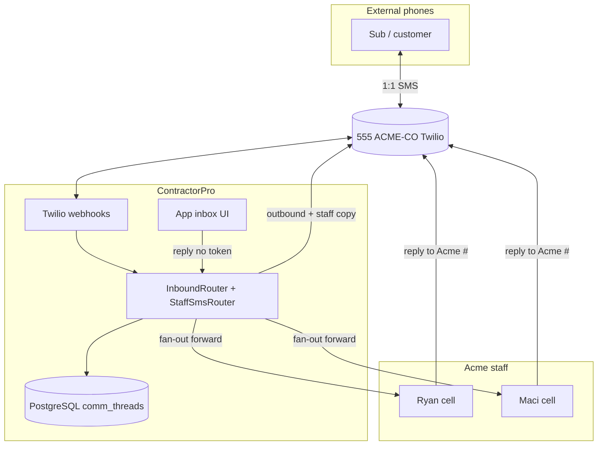

# Company Number & SMS Relay — Architecture

Status: **DECIDED** (2026-08-20)  
Supersedes: [project-handle-numbers.md](./project-handle-numbers.md) (per-project handle model)  
Related: [messaging-and-media.md](./messaging-and-media.md), [architecture-v0.1.md](../architecture-v0.1.md) §1.7, [decision-workbook.md](../../sme-meetings/decision-workbook.md) §1, SME follow-up [company-number-sms-relay.md](../../sme-meetings/sme-follow-ups/company-number-sms-relay.md)

---

## Summary

ContractorPro uses **one Twilio 10DLC number per contractor company** (not per project). All subs and customers text that number. Ryan and Maci coordinate via:

1. **SMS relay (Pattern A)** — staff receive forwards from the company # and reply **to** the company #; platform routes to the external participant and copies the other staff member.
2. **App inbox** — shared visibility, project assignment, system messages, history; optional reply surface (no token required in UI).

**Retired:** per-project handle #s, group MMS with GC personal phone + virtual handle, Twilio Conversations API, JIT number buy on project create, per-project cooling pool.

**Cost shift:** ~$10/active project/month (number rent) → **~$1.15/mo + SMS/MMS volume** per contractor.

---

## Product model (locked)

| Rule | Detail |
|------|--------|
| **Cardinality** | One E.164 per contractor subscription |
| **External UX** | Subs/customers save and text **only** the company # |
| **Staff behavior change** | Ryan + Maci use Acme # for job texts — not personal cells (personal cell traffic is out of scope for logging) |
| **Outbound system** | Approvals, pokes, invites, milestones — from company # with **project prefix** in body |
| **Inbound** | Webhook ingest → thread routing → staff fan-out |
| **Project tag** | Outbound from app: explicit `project_id`. Inbound: best-effort + manual assign in v1 |
| **Provisioning** | First paid tier or first outbound comms — not sandbox signup |
| **Churn** | Release number to Twilio immediately; DB history retained; return customer gets new number |

Coupled decisions: hybrid comm logging (#0), platform 10DLC brand (#1.8), magic-link accept/decline (not SMS YES/NO for schedule actions).

---

## SMS relay (Pattern A)

### Why relay

Carriers do not offer “shared inbox with coordinated reply” natively. The company # is a **relay hub**: external participants never need an app; staff stay in normal SMS with one behavior change — **reply to Acme #, not the sub’s cell**.

### End-to-end flow

```text
1. Mike (sub) ──SMS──▶ (555) ACME-CO
2. Webhook → persist message, resolve Mike → person + thread
3. (555) ACME-CO ──SMS──▶ Ryan:  "[Mike·Maple] Can I start Tuesday?"
4. (555) ACME-CO ──SMS──▶ Maci:   same
5. Ryan ──SMS──▶ (555) ACME-CO:   "Yes Tuesday works"
6. StaffSmsRouter → route to Mike’s thread
7. (555) ACME-CO ──SMS──▶ Mike:   "Yes Tuesday works"
8. (555) ACME-CO ──SMS──▶ Maci:   "[Ryan→Mike] Yes Tuesday works"
```

### Staff relay protocol — **lenient mode + ask when ambiguous**

Staff forwards include a short **ref token** for correlation. Staff are **not** required to type the token on every reply.

| Step | Rule |
|------|------|
| 1 | Token at start of staff reply? → route to that thread |
| 2 | Exactly **one** open thread notified to this staff phone? → route there (no token) |
| 3 | **Multiple** open threads? → **do not guess** — send disambiguation SMS |

**Forward format (staff only):**

```text
Acme [7K2M] Mike·Maple: Can I start Tuesday?
```

**Staff reply — single open thread:**

```text
Yes Tuesday works
```

**Staff reply — after disambiguation prompt:**

```text
7K2M Yes Tuesday works
```

**Disambiguation prompt:**

```text
Acme: 2 active chats —
7K2M Mike (Maple St)
4NPQ Jose (Oak Ave)
Reply with code + message
```

| Parameter | Default |
|-----------|---------|
| Token format | 4–6 alphanumeric (e.g. `7K2M`) |
| Open thread TTL | 72 hours from last staff notification |
| Misroute policy | Never auto-send to external participant on ambiguous staff inbound |

**App reply:** same threads; no token — UI binds `thread_id` directly.

### Staff phone allowlist

Team member phones must bypass carrier **STOP** handling for relay copies — staff texting STOP must not opt out the company line for customers.

---

## Thread model

**Entity:** one thread per `(contractor_id, person_id, project_id, audience)`.

```text
comm_threads
  contractor_id, person_id, project_id (nullable for orphan)
  audience          subcontractor | customer
  status            active | archived | orphan
  assigned_to_user_id   optional claim
  last_message_at
  UNIQUE (contractor_id, person_id, project_id, audience)
```

**UI:** unified inbox with filters (project, participant, audience, unassigned) — not a separate storage model.

**Orphan inbound (0 or N project matches):**

```text
From phone → project_memberships (active, same contractor)

  0 matches  → orphan queue; notify staff
  1 match    → attach thread (common for small GC)
  N matches  → orphan + suggest projects in app; optional name hint in body (never auto-assign without confirm)
```

Customer and sub threads stay **separate** via `audience` — one company # serves both; ACL is data model, not telco.

---

## Twilio stack

| Choice | Decision |
|--------|----------|
| API | **Programmable Messaging** only — drop Conversations / group MMS |
| Number | **10DLC local** per contractor |
| 10DLC | **Platform brand + campaign** (unchanged) |
| Outbound correlation | `MessageSid` + `notification_log.idempotency_key` |
| Schedule accept/decline | **Magic link only** — not SMS YES/NO parsing |
| MMS inbound | Ingest to blob + thread |
| MMS outbound from staff inbox | **Deferred v1** — photos via QR portal (#4/#5) |

### Webhook handler

```text
POST /api/v1/webhooks/twilio
  1. Validate X-Twilio-Signature
  2. Idempotent insert by provider_message_sid
  3. If From = external phone → InboundRouter (thread / orphan)
  4. If From = team member phone → StaffSmsRouter (token / single-open / ask)
  5. Persist message; enqueue InboundMediaIngestWorker if NumMedia > 0
  6. Fan-out staff notifications (SMS relay + in_app)
  7. Return 200 within Twilio timeout
```

Status callback: `/api/v1/webhooks/twilio/status` → update delivery status on `messages` / `notification_log`.

---

## Number lifecycle

```text
contractor_phone_numbers
  contractor_id       UNIQUE (one active number per company in MVP)
  e164, provider_sid, status (provisioning | active | released)
  provisioned_at, released_at
```

| Event | Behavior |
|-------|----------|
| Sandbox signup | No number |
| First paid / comms enabled | Provision company # |
| Active subscription | Number retained |
| Churn | Release immediately; historical e164 on contractor for display |
| Return customer | New number |

**Retired:** `PhoneNumberCoolingService`, per-project JIT on create, `projects.handle_phone_id` as routing key (historical display only after migration).

---

## Outbound message types

| Type | DB fields | SMS body |
|------|-----------|----------|
| Sub approval / poke | `project_id`, `assignment_id`, `membership_id` | Project prefix required |
| Customer milestone | `project_id`, milestone ref | Project prefix required |
| Invite / join | `project_id`, invite token | Project prefix required |
| GC reply (SMS or app) | `thread_id`, `project_id`, sender user id | Prefix optional on human replies |

Example system SMS:

```text
Maple St · Riverside — Confirm electrical Aug 25: https://app…/c/abc
```

---

## Shared inbox (Ryan + Maci)

| Topic | Decision |
|-------|----------|
| Reply surface | **SMS relay + app inbox** (both use same threads) |
| Inbound alert | In-app + optional email; SMS fan-out to staff for relay |
| SMS to personal phones for alerts | **Yes** — as relay forwards from company # (not parallel sub threads) |
| Collision | Show last replier; optional thread claim in app |
| Team scope | All team members see all threads in MVP |
| Real-time | Polling 60s (SignalR deferred) |

**Risk:** Ryan texting sub’s personal cell bypasses relay — out of scope (#0); train “Acme # everywhere.”

---

## Data model delta (from v0.1 per-project)

| Old | New |
|-----|-----|
| `mms_threads` | `comm_threads` (drop `conversation_sid`, handle on thread) |
| `phone_number_pool` (many per company) | `contractor_phone_numbers` (0..1 active) |
| `MmsMediaIngestWorker` | `InboundMediaIngestWorker` |
| `projects.handle_phone_e164` routing | Historical display only |

New supporting tables:

```text
staff_sms_sessions
  contractor_id, staff_phone_e164, thread_id, ref_token
  notified_at, expires_at

in_app_notifications
  team_member_id, thread_id, message_id, read_at
```

---

## Architecture diagram



---

## Open risks

| Risk | Mitigation |
|------|------------|
| Ryan never uses relay / texts sub direct | Onboarding; SME validation session |
| Double reply (Ryan + Maci) | Fast fan-out + last-reply indicator |
| Multi-project sub inbound | Orphan queue + manual assign |
| 10DLC lead time | Start Trust Hub before prod |
| Staff finds tokens goofy | Lenient mode — tokens only when ambiguous |

---

## SME validation

Walk Ryan + Maci through scripted flows before build lock — see [company-number-sms-relay.md](../../sme-meetings/sme-follow-ups/company-number-sms-relay.md).

---

## References

- [Twilio Messaging webhooks](https://www.twilio.com/docs/messaging/guides/webhook-request)
- [Twilio A2P 10DLC](https://www.twilio.com/docs/messaging/guides/a2p-10dlc)
- Architect handoff: [winston-company-phone-number.md](../../sme-meetings/handoffs/winston-company-phone-number.md)

Log updates in [discovery-log.md](../discovery-log.md).
